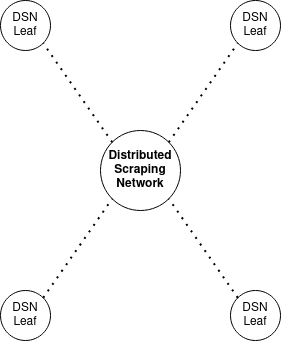

# DSN Leaf

This repository serves to provide a leaf node within the [Distributed Scraping Network (DSN)](https://spatiotemporal-wildlife-classification.github.io/Distributed-Scraping-Network/).
The DSN provides a central point of communication for the leaf node through the use of a [FastAPI](https://fastapi.tiangolo.com/).

The leaf node communicates with the central DSN to determine essential wildlife observation details, required 
to make a weather data request to the [Open-Meteo historical API](https://open-meteo.com/en/docs/historical-weather-api). 
Once the data is retrieved, the leaf node formats the collected data, and posts it back to the central DSN for collection and storage. 

In summary, the leaf node collects the weather/ metadata for each observation and transfers it to a central storage. 
This enables the creation of the  [Spatiotemporal Wildlife Classification's](https://spatiotemporal-wildlife-classification.github.io/Wildlife-Classification/) novel dataset, specifically
the metadata values.

The novel dataset is available at: [https://www.kaggle.com/datasets/travisdaws/spatiotemporal-wildlife-dataset](https://www.kaggle.com/datasets/travisdaws/spatiotemporal-wildlife-dataset).

